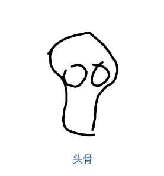

# 《猜画小歌》小技巧

这几天略沉迷这个小游戏，反复玩，完全是理工男基于写代码的基础在测试 AI 的思路，因为画技拙劣，更加上手指头的笨拙，只能靠偷鸡过关，先找点理论依据，搜索印象笔记，翻出《哥德尔、巴赫和埃舍尔》的笔记，找出这两段：

“集聚”是指构造这样一些描述，其焦点是框中图像的某一部分，而排除其他部分。
“过滤”是指构造这样一些描述，他以某种特定的方式来观察框的内容，而完全不顾其他方面。

这二者是互补的。作者侯世达重点提到了 邦加德的《模式识别》，同时也讲到图像识别的几层逻辑：

1：在照片中寻找事先说明的物体
2：把一副图像分解成独立的物体
3：在一副图像中辨别出独立的物体
4：根据人提供的简图识别物体
5：识别人的面容

经过几次简单的尝试过，就是前四点的运营，首先声明，这个游戏不是要考验画的是否真像（当然像了确实更厉害），而是通过一定的算法识别，很明显，游戏规则就是逻辑1，在图中寻找事先声明的物体，而且识别的比较宽泛，准确说是寻找相似的东西，只要接近目标物体特定规则，几乎都可以识别。

所以首先要注意可识别的特征，要抓区分最明显的特征，比如烤面包机可以画满面包；画热狗当然是画香肠；画电脑注意键盘，画电视注意天线（这个题老年人有优势），抓准抽象好画的特征是过关的关键。

比如“蒙娜丽莎”，是为了寻找与名画《蒙娜丽莎》相似的东西，不要执拗于蒙娜丽莎的微笑，你画不出，AI也识别不了。抽象一下，构成名画《蒙娜丽莎》的主要元素：画框、女人；这就好处理了，先画框，再画人形，加上长发，就有了下面这幅画。

另外有些太过于抽象的简单东西，即使按照这个思路，也难以具备可识别性，因为过于简单和抽象，可以被识别成太多东西，这时可以提供一定的辅助物来识别，比如香蕉和弯月，可以先话弯月形状，旁边画个星星，就是月亮，加个根部就是香蕉；比如太阳和月亮和圆，儿童常画，太阳添加光芒，月亮添加星星，圆添加其他形状。

大概就是这两个招，不断反复试用，效果还行，你也试试吧。
最后晒晒成果。

